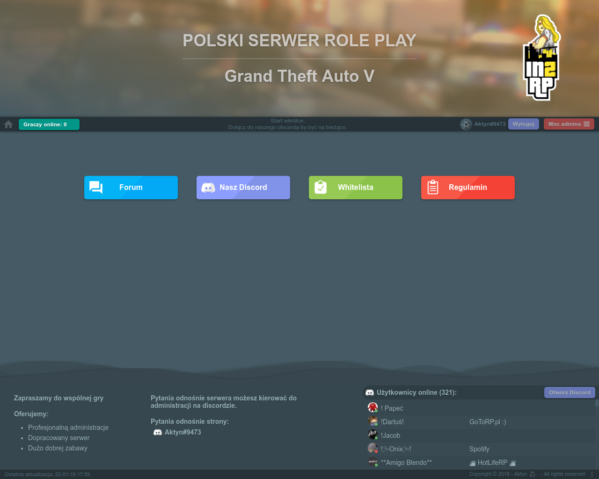
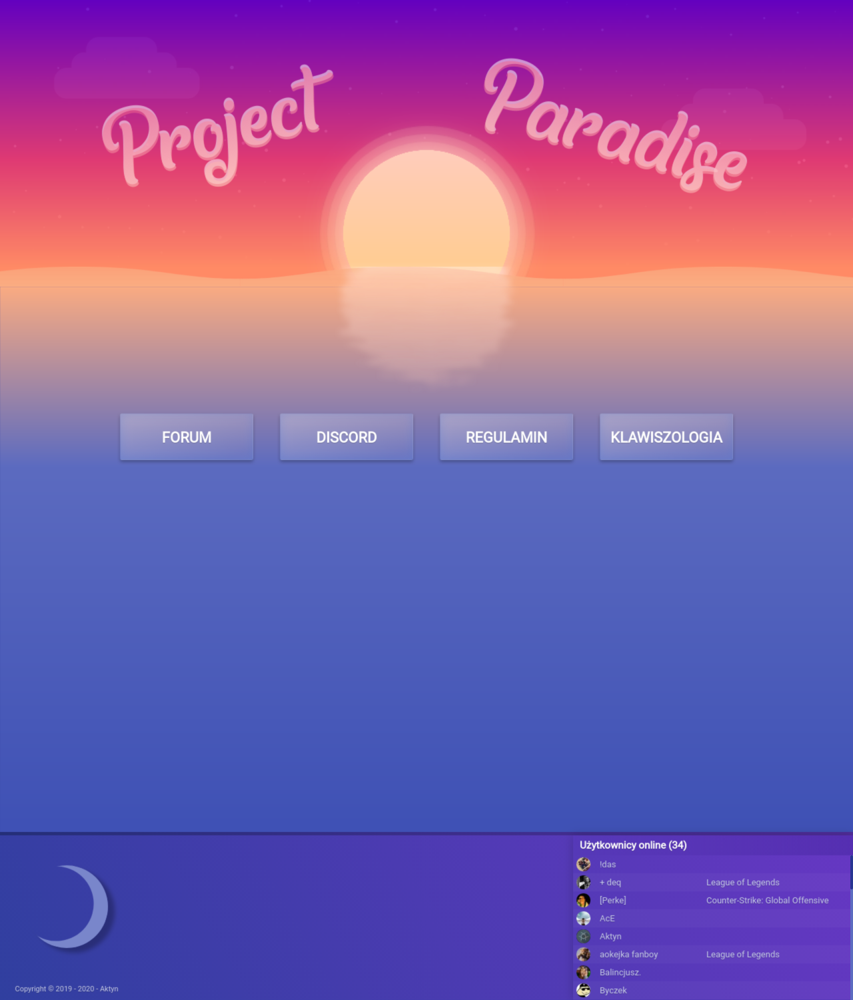
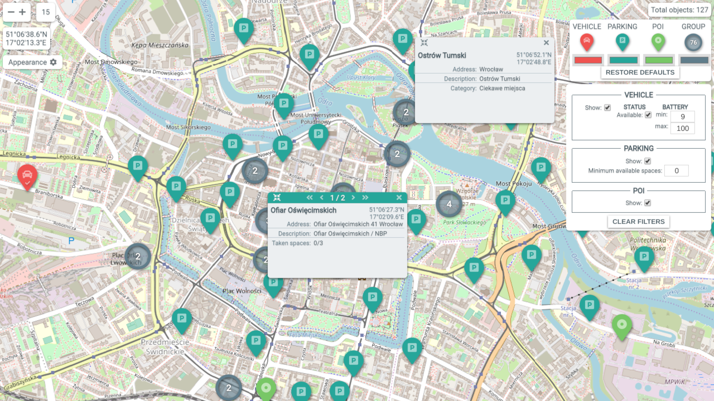
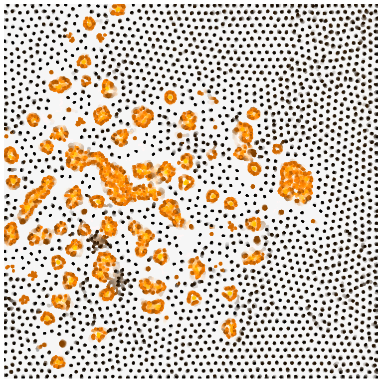
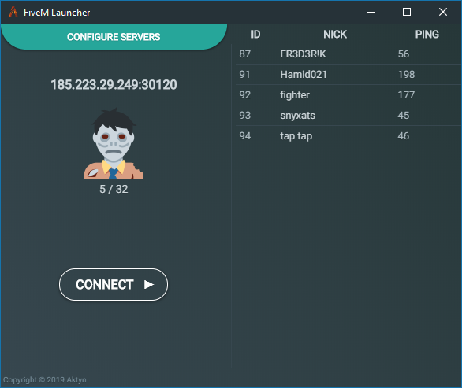
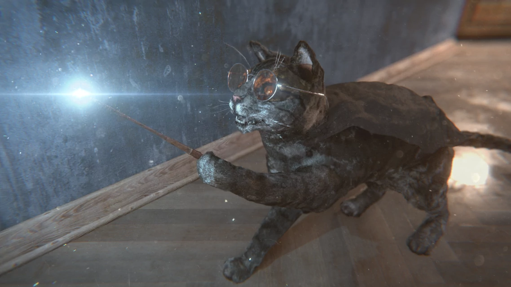

<h1 align="center">Games</h1>

  

---

<h1 align="center">Websites</h1>

  
  

---

<h1 align="center">Web and electron applications</h1>

  
  
  

---

<h1 align="center">Graphics</h1>

  
  
  
  

---

<h1 align="center">Some statistics</h1>

   

  
  
  

  

  

---

<h3 align="center">Languages and tools</h3>

  
  
  
  
   
  
  
  
  
  

  
  
  
  

  
  

  
  
  
  

  
  
  

